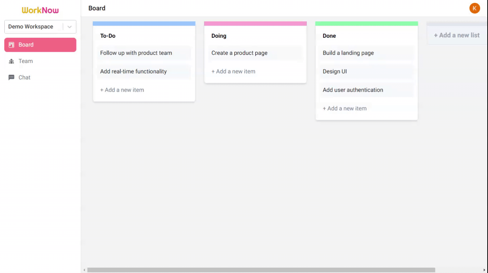

## Project Description

WorkNow is a project management app that helps to manage all tasks
in one place, thus making collaboration simpler and the entire
workflow much more efficient. It allows for real-time
communication between members working on the same project, i.e.
real-time updates on the board and the chat functionality.

The app is running live at [https://work-now.vercel.app](https://work-now.vercel.app), and details about the project can be found at www.someurl.com

## Running The App

First, clone the repository and install the required packages:

```bash
git clone https://github.com/freddyz00/WorkNow.git
cd WorkNow
npm install
```

Then run the development server

```bash
npm run dev
```

Open [http://localhost:3000](http://localhost:3000) with your browser to see the app running in action.
